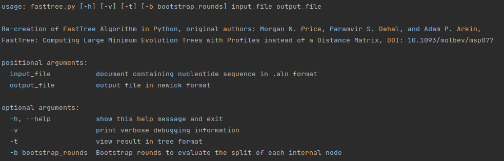

# FastTree

Re-creation of FastTree Algorithm in Python

FastTree: Computing Large Minimum Evolution Trees with Profiles instead of a Distance Matrix
original authors: Morgan N. Price, Paramvir S. Dehal, and Adam P. Arkin

DOI: 10.1093/molbev/msp077

## Installation
Install necessary packages by running:

`pip install -r requirements.txt`

## Running the FastTree algorithm
